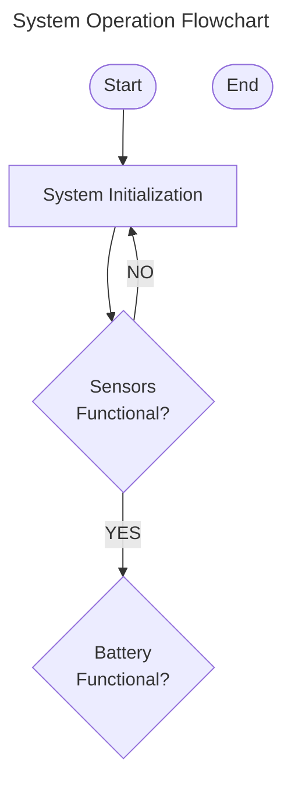

# System Operation

## 1. Operational Flowchart

```mermaid
---
title: System Operation Flowchart
---
flowchart TD
    Start([Start])

    %% System Initialization Blocks
    sys_init[System Initialization]
    sys_check1{Sensors<br>Functional?}
    sys_check2{Battery<br>Functional?}

    Start --> sys_init
    sys_init --> sys_check1
    sys_check1 -->|YES| sys_check2
    sys_check1 -->|NO| sys_init


    End([End])


```

## 2. Operational Sequence Diagram
